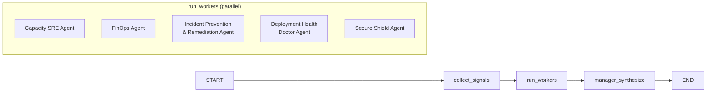

# Manager Agent

**Source:** `aiops/app/manager.py`

---

## Role

The Manager Agent is the final node in the LangGraph graph. It does not collect telemetry directly. Instead it receives the `AgentFinding` objects produced by all five worker agents and synthesises them into a single `ManagerAnalysis` response.

Its responsibilities:

- **Correlation** — identify relationships between findings from different agents (e.g. a CrashLoopBackOff reported by Incident Prevention and an OutOfSync deployment reported by Deployment Health Doctor are likely related)
- **Deduplication** — collapse overlapping recommendations from multiple agents into a single ordered action list
- **Prioritisation** — rank recommended actions by severity, risk, and automation availability
- **Explanation** — produce a human-readable summary that a non-expert can act on

---

## Orchestration Graph



All five workers run in parallel via `asyncio.gather`. The Manager Agent waits for all findings before starting synthesis. Per-collector and per-worker timeouts prevent one slow source from blocking the response.

---

## Synthesis Modes

### LLM Mode (`"llm_mode": "local"`)

When Ollama is reachable, the Manager Agent sends a structured JSON payload (question + all worker findings) to the local LLM using the prompt at `aiops/app/prompts/manager.md`. The LLM returns a JSON `ManagerAnalysis` object that the Manager Agent validates and returns.

### Fallback Mode (`"llm_mode": "fallback"`)

When Ollama is unreachable (or returns unparseable JSON), the Manager Agent runs `manager_fallback_synthesis` from `aiops/app/fallback_rules.py`. This rule-based path inspects the worker findings deterministically and produces a valid `ManagerAnalysis` without LLM involvement. The response quality is lower but the system remains functional.

---

## Output Schema

The Manager Agent returns a `ManagerAnalysis` object:

```python
class ManagerAnalysis:
    summary: str               # One-paragraph human-readable summary
    severity: str              # "critical" | "high" | "medium" | "low" | "healthy"
    confidence: float          # 0.0–1.0
    recommended_actions: list[RecommendedAction]
    evidence: list[EvidenceItem]
    worker_summaries: dict     # Per-agent status and key finding
    llm_used: bool
    data_mode: str             # "live" | "demo"
```

See [Confidence & Severity Scoring](scoring.md) for how `severity` and `confidence` are determined.
