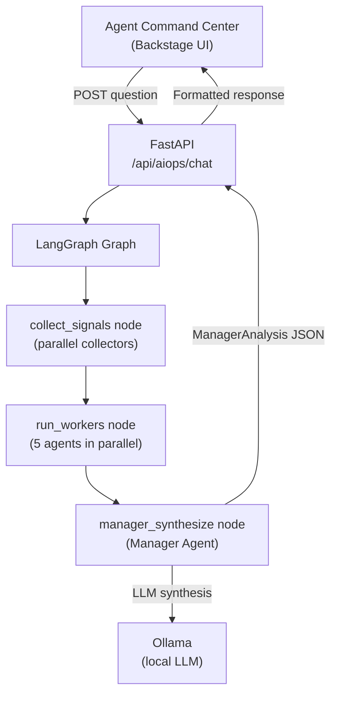

# AIOps Overview

**Audience:** Platform Engineers, Operations Support  
**Route:** `/aiops`

---

## What the AIOps Engine Is

The AIOps engine is a Python FastAPI service (`aiops/`) running a LangGraph-based multi-agent orchestration graph. It exposes a `/api/aiops/chat` endpoint that Backstage calls when you submit a question in the [Agent Command Center](../aiops/index.md).

The engine uses a local LLM (Ollama) for natural-language synthesis when available, falling back to deterministic rule-based analysis when the LLM is unreachable.

---

## Architecture



---

## Engine Health

The `/aiops` page in IPP shows:

- **Engine status** — reachable / unreachable
- **LLM mode** — `local` (Ollama) or `fallback` (rule-based)
- **Collector status** — which telemetry sources returned data in the last query

Check engine health directly:

```bash
curl http://aiops.dpcs.local/health
```

A healthy response includes `"llm_mode": "local"`. If it shows `"fallback"`, Ollama is not reachable — see [Troubleshooting](../troubleshooting.md#aiops-engine).

---

## Next Steps

- [Agent Command Center](../aiops/index.md) — the natural-language chat interface
- [Manager Agent](../aiops/manager-agent.md) — how synthesis works
- [Worker Agents](../aiops/worker-agents.md) — the five specialist agents
- [Telemetry Sources](../aiops/telemetry-sources.md) — data sources and LIVE/DEMO/N/A tags
