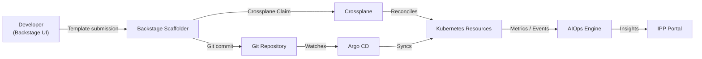

# Control Plane

**Audience:** Platform Engineers  

---

## Overview

The Control Plane section exposes the three infrastructure automation subsystems that underpin all self-service workflows on IPP: Crossplane (infrastructure provisioning), Argo CD (GitOps delivery), and the AIOps engine (intelligence layer).

---

## Pages in This Section

| Page | Route | Purpose |
|---|---|---|
| [Crossplane](crossplane.md) | `/crossplane` | View and manage Composite Resource Claims |
| [GitOps](gitops.md) | `/gitops` | Argo CD application sync status and history |
| [AIOps Overview](aiops-overview.md) | `/aiops` | AIOps engine health and telemetry status |
| Agent Command Center | `/aiops-chat` | Natural-language interface to the multi-agent system |

---

## Provisioning Flow

1. Developer submits a **Create** form in Backstage (selects a software template).
2. The **Backstage Scaffolder** renders the template and commits generated files to Git.
3. The scaffolder also creates a **Crossplane Claim** (e.g. `ThreeTierApp`).
4. **Crossplane** reconciles the Claim into Kubernetes resources (namespace, Deployment, Service, PersistentVolumeClaim).
5. **Argo CD** detects the new Git commit and syncs the Argo CD Application, deploying the workloads.
6. **AIOps** begins collecting telemetry and is available for natural-language queries immediately.
