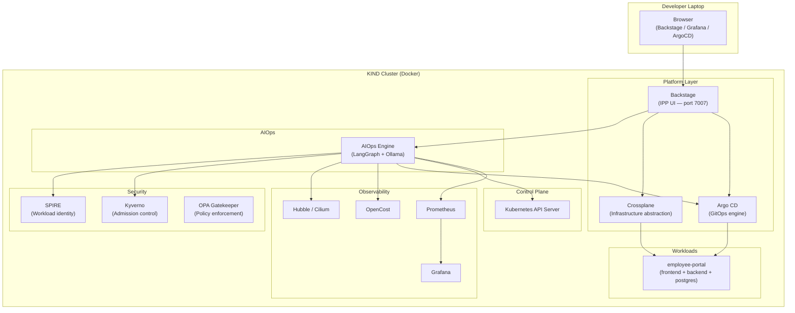

# IPP — Infrastructure Platform Portal

**Audience:** All engineering personas — Developers, Platform Engineers, Operations, Security Analysts, Tech Providers  
**Last reviewed:** 2026-06-14

---

## What is IPP?

The Infrastructure Platform Portal (IPP) is DHL's Internal Developer Platform — a single pane of glass built on [Backstage](https://backstage.io) that abstracts infrastructure complexity away from application teams while giving platform engineers and operators complete visibility, policy enforcement, and cost control.

IPP turns infrastructure requests — which previously required days of ticket-based coordination — into deterministic, auditable, policy-governed self-service workflows.

---

## Core Capabilities

| Capability | Description |
|---|---|
| **Self-service provisioning** | Backstage software templates generate Crossplane Claims. Developers get running workloads without filing infrastructure tickets. |
| **GitOps delivery** | All changes flow through Argo CD. Git is the single source of truth; every deployment is auditable and reversible. |
| **Zero-trust security** | SPIFFE/SPIRE issues cryptographic workload identities. Cilium enforces L3/L4/L7 network policy. OPA Gatekeeper and Kyverno enforce admission control. |
| **Full-stack observability** | Prometheus + Grafana cover cluster and application metrics. Hubble provides network-flow visibility. OpenCost attributes spend to namespaces and workloads. |
| **AIOps intelligence** | A LangGraph-based multi-agent system correlates signals from all platform sources and surfaces prioritised, actionable recommendations in natural language. |

---

## Platform Architecture

---

## Left-Nav Structure

| Section | Pages |
|---|---|
| **Platform** | Home · Marketplace · Catalog · Create · Docs |
| **Operations** | Operations · Security · Cost |
| **Control Plane** | Crossplane · GitOps · AIOps · Agent Command Center |
| **Advanced** | FinOps Visibility · Autonomous Ops · Settings |
| **Platform Engineering** | Onboard App · My Resources · Day 2 Ops · Infra Costs |

---

## Personas

Access to pages and actions is governed by the active persona session. See the [Getting Started](getting-started.md) guide for login instructions.

| Persona | Primary Use Cases |
|---|---|
| Developer | Catalog browsing, Create (templates), Docs |
| Platform Engineer | Full platform access, Crossplane, GitOps, AIOps, onboarding |
| Operations Support | Operations dashboards, AIOps chat, incident response |
| Security Analyst | Security dashboard, policy views, Secure Shield agent |
| Tech Provider | Marketplace, template management |
